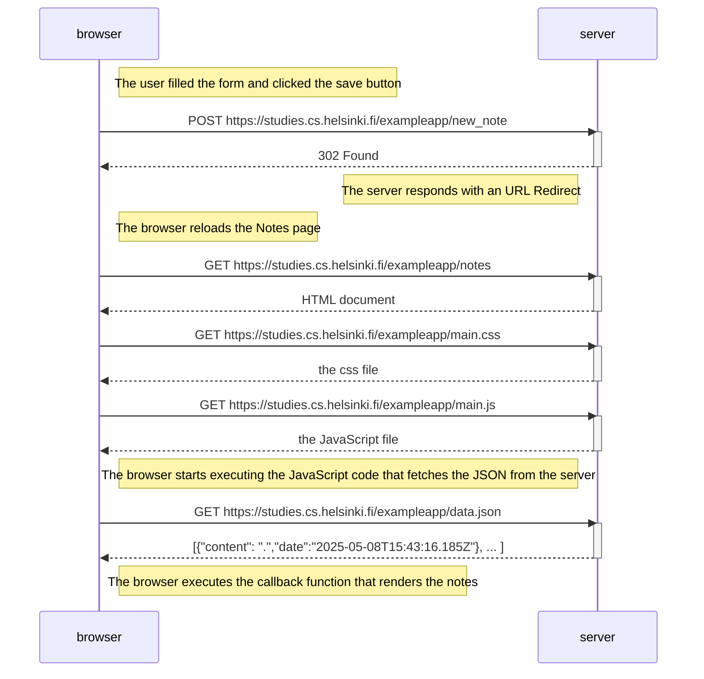

# Exercise 0.4: New note diagram

In the following diagram we are going to see how is the chain of events when a user creates a new note on the page

```mermaid
sequenceDiagram
    participant browser
    participant server

    Note right of browser: The user filled the form and clicked the save  button

    browser->>server: POST https://studies.cs.helsinki.fi/exampleapp/new_note
    activate server
    server-->>browser: 302 Found
    deactivate server    

    Note left of server: The server responds with an URL Redirect

    Note right of browser: The browser reloads the Notes page

    browser->>server: GET https://studies.cs.helsinki.fi/exampleapp/notes
    activate server
    server-->>browser: HTML document
    deactivate server

    browser->>server: GET https://studies.cs.helsinki.fi/exampleapp/main.css
    activate server
    server-->>browser: the css file
    deactivate server

    browser->>server: GET https://studies.cs.helsinki.fi/exampleapp/main.js
    activate server
    server-->>browser: the JavaScript file
    deactivate server

    Note right of browser: The browser starts executing the JavaScript code that fetches the JSON from the server

    browser->>server: GET https://studies.cs.helsinki.fi/exampleapp/data.json
    activate server
    server-->>browser: [{"content": ".","date":"2025-05-08T15:43:16.185Z"}, ... ]
    deactivate server

    Note right of browser: The browser executes the callback function that renders the notes
```
