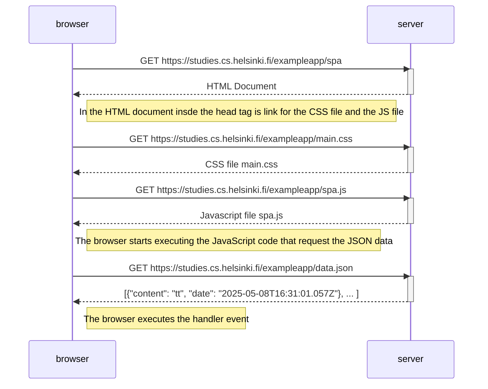

# Exercise 0.5: Single page app diagram

Diagram depicting the situation where the user goes to SPA version of the notes app

```mermaid
sequenceDiagram
    participant browser
    participant server

    browser->>server: GET https://studies.cs.helsinki.fi/exampleapp/spa
    activate server
    server-->>browser: HTML Document
    deactivate server    

    Note left of server: In the HTML document insde the head tag is link for the CSS file and the JS file

    browser->>server: GET https://studies.cs.helsinki.fi/exampleapp/main.css
    activate server
    server-->>browser: CSS file main.css
    deactivate server

    browser->>server: GET https://studies.cs.helsinki.fi/exampleapp/spa.js
    activate server
    server-->>browser: Javascript file spa.js
    deactivate server

    Note right of browser: The browser starts executing the JavaScript code that request the JSON data

    browser->>server: GET https://studies.cs.helsinki.fi/exampleapp/data.json
    activate server
    server-->>browser: [{"content": "tt",  "date": "2025-05-08T16:31:01.057Z"}, ... ]
    deactivate server

    Note right of browser: The browser executes the handler event
```
